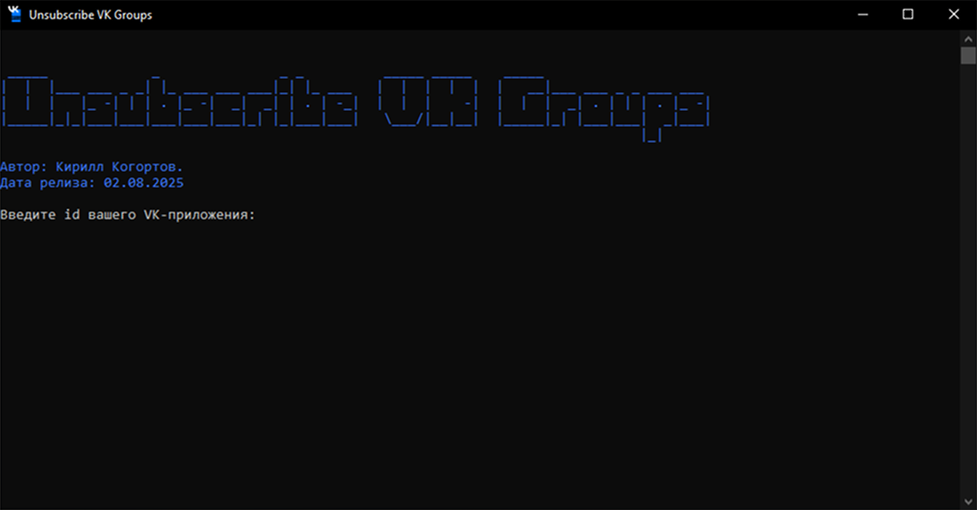

# UnsubscribeVKGroups  

**UnsubscribeVKGroups** — это консольная утилита, которая позволяет пользователю быстро и просто отписаться от всех сообществ, на которые он подписан во ВКонтакте.

---

## ⚙️ Возможности

- Получение списка всех групп пользователя
- Массовая отписка от сообществ
- Цветной интерфейс с прогрессом
- Защита от обрезки токена при вставке
- Обработка ошибок VK API

---

## 🛠 Что нужно для запуска

Для работы утилиты требуется создать собственное приложение ВКонтакте:

1. Перейдите по ссылке: [https://vk.com/apps?act=manage](https://vk.com/apps?act=manage)
2. Нажмите **«Создать приложение»**
3. Выберите тип **Standalone-приложение**
4. Скопируйте **ID приложения (client_id)**

---

## 🚀 Как пользоваться

1. **Запустите утилиту `UnsubscribeVKGroups`**
2. Введите `client_id` вашего VK-приложения
3. Получите ссылку для авторизации (будет выведена в консоли)
4. Перейдите по ссылке в браузере и **авторизуйтесь**
5. После авторизации скопируйте **полную ссылку из адресной строки**
6. Вставьте её обратно в утилиту `UnsubscribeVKGroups`
7. Утилита автоматически извлечёт токен и начнёт отписку от всех сообществ

---

## Пример результата
Отписался от группы ID: 123456  
...  
Отписался от группы ID: 654321  
Готово! Всего отписался от 248 групп.  

---

## 🔐 Приватность

Утилита работает **локально** и не сохраняет ваш токен. Все действия выполняются напрямую между вами и VK API.

---
